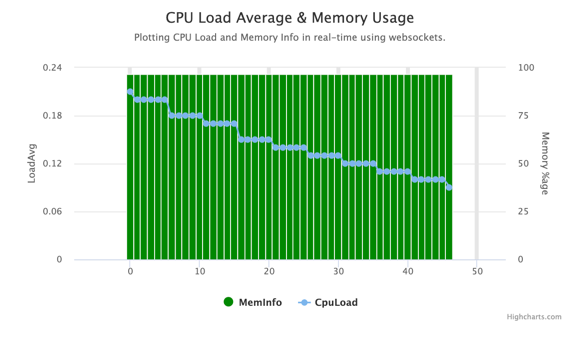

# Getting started with multicontainer on balena

[](https://dashboard.balena-cloud.com/deploy?repoUrl=https://github.com/u93/multicontainer-getting-started)

This is a simple skeleton multicontainer web application project that works on any of the [devices supported][devices-supported] by [balena][balena-link].

This project serves up a welcome page on port `:80` of your balena device.

To get this project up and running, you will need to [sign-up][signup-page] for a balena account. Have a look at our [Getting Started tutorial][gettingStarted-link] to help you kickstart your journey in creating a fleet of devices. Once you are set up with balena, you will need to clone or download this repository. 

After downloading, navigate to the directory and run the `balena push` command using the [balena CLI][balena-cli]. This command will package up and push the code to the balena builders, where it will be compiled, built and deployed to every device in the fleet. When it completes, you'll have a multicontainer application running on your device and you can see some logs on your [device dashboard][balena-dashboard].

```bash
cd multicontainer-getting-started/
balena push <FLEET_NAME>
```

To give your device a public URL, access the device page on the [balenaCloud dashboard][balena-dashboard], and choose the _Public Device URL_ toggle. Once the device is updated, check the Public Device URL to find the welcome page showing up from your device. That's it, you have deployed your first balena device!

For local development and testing using docker-compose CLI make sure that your are using an x86 machine (for example, not a Mac M1). To run locally use the command below.

```bash
docker-compose -f docker-compose.yml up --build
```

You can verify that is running by going to http://127.0.0.1:80 and see something like the image below.



[balena-cli]:https://www.balena.io/docs/reference/cli/
[balena-dashboard]:https://dashboard.balena-cloud.com/
[balena-link]:https://balena.io/ 
[devices-supported]:https://www.balena.io/docs/reference/hardware/devices/
[gettingStarted-link]:https://www.balena.io/docs/learn/getting-started/raspberrypi3/python/
[signup-page]:https://dashboard.balena-cloud.com/signup